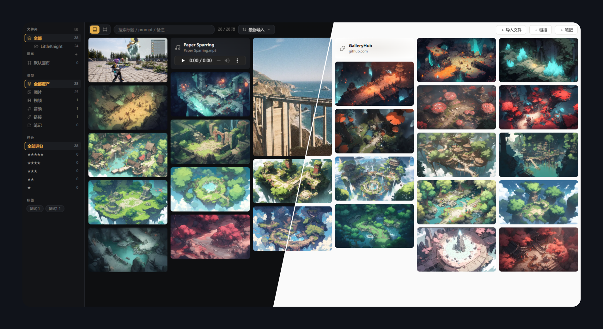
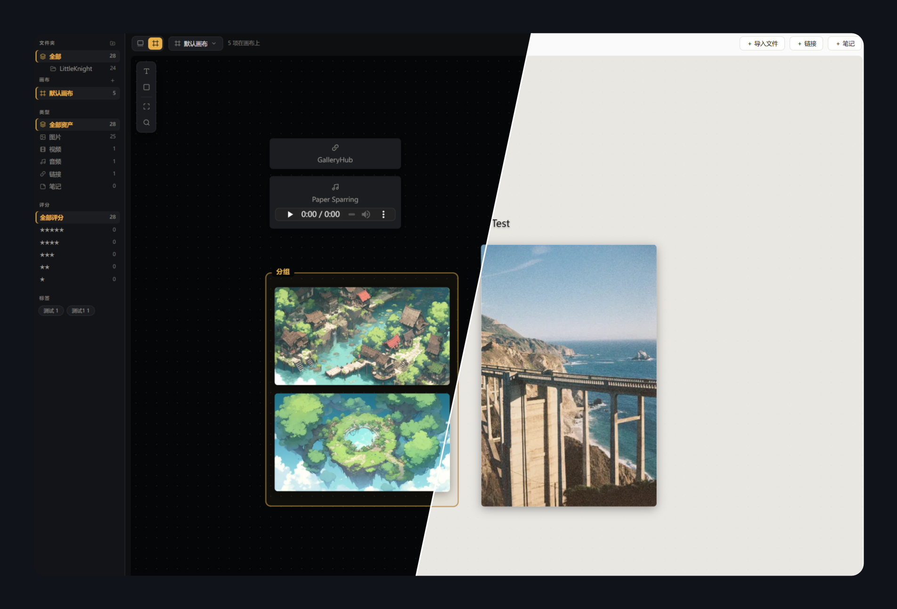

# GalleryHub

**English** | [中文](README_CN.md)

> An art asset gallery plugin for Obsidian — manage images, videos, audio and links together with AI generation prompts. Waterfall gallery + infinite canvas for curation, with 100% of your data staying in your local vault.

  

## Preview

**Gallery** — masonry browsing with sidebar filters (dark / light):



**Canvas** — PureRef-style curation boards with annotations:



## Why

Art assets end up scattered everywhere: AI-generated images and their prompts, photography, reference images, video/audio clips, inspiration links… Existing tools each cover only a slice — Eagle/Billfish are asset libraries with no canvas and closed data formats; PureRef is a canvas that doesn't manage a long-term library; Firefly Boards / Figma Weave attach prompts but keep your assets in the cloud. **Nothing covers four asset types + prompt metadata + local data ownership at once.**

GalleryHub brings it all into Obsidian: data (JSON + original files) lives inside your vault and syncs with whatever you already use, browsing lives next to your notes, and everything stays portable forever.

## Features

### Gallery (waterfall/masonry)
- **Four asset types**: images / videos (hover to play) / audio (inline player) / links
- **True masonry layout**: aspect ratios preserved, dimensions captured at import to prevent layout shift, column count adapts to pane width
- **Filtering**: folder tree / boards / type / multi-select star rating / tag cloud — each module can be toggled in settings
- **Search** across title, prompt, note and file name; **sorting** by import time, title, rating or type
- **Multi-select & batch ops**: Ctrl+click / checkmark / Space to select; batch move, delete (optionally to system trash), edit tags (append/replace/remove) and rating, send to board

### Folder tree
- Full mapping of the `assets/` directory tree with nested expand/collapse
- Context menu: new subfolder (inline rename), rename (F2), delete (to trash)
- Drag & drop: move folders, drop cards into folders (whole selection), drop OS files onto a folder for targeted import
- Library paths stay in sync after rename/move — nothing breaks

### Infinite canvas (PureRef-style curation)
- Pan (Space/middle-click), zoom at pointer (0.05x–8x), marquee selection with group drag
- Cards: drag, proportional resize, bring to front / send to back, double-click for details
- **The same asset can live on multiple boards with independent layouts**
- Text and frame annotations: inline editing, font size & bold, 8-color palette
- Drop files straight onto the canvas — they're imported and placed where you dropped them
- Multiple boards: create / rename / delete, quick access from the sidebar

### Detail lightbox
- Large viewer: click to zoom to native size, drag to pan; prev/next navigation (buttons or ←/→)
- Inline title editing, star rating, tag chips editor, source link, custom source file location
- **AI generation section** (collapsible): prompt / negative (one-click copy), model / seed
- Actions: open original in Obsidian, open in browser, reveal in system explorer, remove from library

### Themes & language
- **Dark** (charcoal + amber) / **Light** (warm white + gold) / follow Obsidian
- UI in **English and 中文**, defaults to following Obsidian's language

## Data design

```
Your vault/
└── GalleryHub/            # location configurable in settings
    ├── gallery.json        # the single database (open schema, versioned)
    ├── gallery.json.bak    # automatic per-session backup
    └── assets/             # original files, organized in folders
```

- Plain text + original files — readable without the plugin, portable forever
- Debounced saves, write-ahead backup, read-only guard on corruption, auto-reload on external (cloud-sync) changes
- Each item records: path, title, tags, rating, source, note, `gen` (prompt/negative/model/seed…), `layouts` (per-board positions)

## Installation

Not yet in the community store — manual install:

1. Grab `manifest.json` / `main.js` / `styles.css` from a release (or build them yourself)
2. Put them in `<vault>/.obsidian/plugins/gallery-hub/`
3. Settings → Community plugins → enable **GalleryHub**
4. Click the ribbon icon; the data folder is created automatically on first run

## Development

```bash
npm install
npm run dev      # watch build, outputs straight into your vault's plugin folder (path in esbuild.config.mjs)
npm run build    # production build → dist/main.js
npm run deploy   # copy manifest / main.js / styles.css into the plugin folder
```

Code and data are fully separated: this repo holds only source; assets and the database live in your vault.

### Architecture

```
src/
├── main.ts       plugin entry: view registration, commands, settings, theme/locale
├── view.ts       GalleryView: masonry, sidebar (tree/boards/filters), multi-select, mode switch
├── canvas.ts     CanvasBoard: infinite canvas (pan/zoom/cards/text/frames/palette)
├── store.ts      data layer: gallery.json I/O, debounced saves, backups, boards & elements CRUD
├── importer.ts   import & file ops: ingest, folder tree operations, batch move/delete
├── detail.ts     detail lightbox and all dialogs (link/folder/confirm/batch edit)
├── i18n.ts       lightweight dictionary (en/zh) with typed keys
└── types.ts      data contracts and defaults
```

## Roadmap

- [x] **V1** Gallery MVP: masonry, filter & search, detail editing, import
- [x] **V2** Infinite canvas: multi-board, text/frame annotations, send-to-board
- [ ] **V3** Automation: auto-extract embedded generation params from PNGs (A1111/ComfyUI), hash dedupe, Markdown gallery export
- [ ] **V4+** Mobile polish, JPEG/XMP metadata, note linking, community store release

## License

MIT © [DuranceX](https://github.com/DuranceX)
